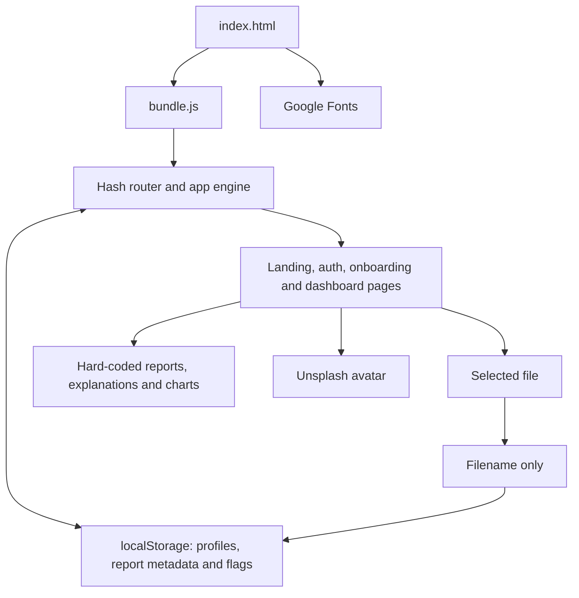

# MedLens folder audit

Assessed on 2 October 2026. Scope: the supplied `mansi-UI-main` folder. Application files under `medlens/` were left unchanged. Audit notes, synthetic fixtures, screenshots and reproduction scripts were added under `audit/`.

**Verdict: this is a browser-only medical dashboard prototype. It is unsuitable for real patient information in its current form.** Its visual interface is substantially more complete than its authentication, storage and medical-processing capabilities. Several controls claim successful operations that have no implementation behind them.

The most urgent problems are ignored passwords, stored script execution, shared data between local accounts, discarded report documents, and sample medical results displayed as if they belong to an uploaded file. These require substantive fixes before ordinary UI polishing.

Some omissions are explicitly marked as intentional placeholders, particularly the analysis engine. A placeholder is reasonable in a prototype; displaying it alongside claims of secure document storage, verified clinical results and active encryption is the problem. Code alone cannot establish whether AI generated the folder or which tool was used.

## What is in the folder

The root contains a README with only `# Medlens-` and the `medlens/` directory. There is no Git repository in this supplied checkout, package manifest, lockfile, build script, test suite, backend, database schema, environment configuration or deployment configuration.

There are 18 files inside `medlens/`, totaling 1,025,960 bytes: HTML, CSS and 16 JavaScript files. Fourteen JavaScript files are application source modules; the other two are the standalone application bundle and the icon library.

| File or area | Purpose | Runtime relevance |
|---|---|---|
| [index.html](C:/Users/Mahipal555/Downloads/mansi-UI-main/medlens/index.html:1) | HTML shell, Google Fonts, icon script, root/modal/toast containers | Actual entry point |
| [bundle.js](C:/Users/Mahipal555/Downloads/mansi-UI-main/medlens/js/bundle.js:1) | 3,122-line standalone copy of data, UI components and state engine | **The application actually runs this file** |
| [app.js](C:/Users/Mahipal555/Downloads/mansi-UI-main/medlens/js/app.js:16) | Modular state engine and hash router | Not loaded by the supplied HTML |
| [mockData.js](C:/Users/Mahipal555/Downloads/mansi-UI-main/medlens/js/data/mockData.js:1) | Mock patient, report/history fixtures, lab samples and explanations | Has a separately copied version inside the bundle |
| `components/landing.js`, `navbar.js` | Marketing page, sample report tabs, navigation | Separate copies inside the bundle |
| `components/auth.js`, `onboarding.js` | Login/signup UI and patient details form | Source auth behavior differs materially from the bundle |
| `components/dashboardHome.js` | Dashboard, report summaries, upload UI, charts and shortcuts | Separate copy inside the bundle |
| `components/reports.js`, `history.js`, `profile.js` | Report locker, history and profile pages | Separate copies inside the bundle |
| `components/modals.js`, `analysisPlaceholder.js` | Dialogs and the explicit analysis placeholder | Separate copies inside the bundle |
| `components/home.js`, `dashboard.js` | Older home screen and a dashboard forwarding wrapper | Unreachable from the modular app import graph; also absent from the active bundle |
| [styles.css](C:/Users/Mahipal555/Downloads/mansi-UI-main/medlens/css/styles.css:1) | 2,859 lines of styling, animation and responsive rules | Active shared stylesheet |
| [lucide.min.js](C:/Users/Mahipal555/Downloads/mansi-UI-main/medlens/js/lucide.min.js:1) | Local icon library, header declares Lucide v1.47.0 and ISC license | Active; 659,979 bytes, despite the `.min.js` filename |

The application has a coherent visual direction and useful starting components. The CSS includes reduced-motion handling, and ordinary inputs have a focus style. The inspected application code has no `eval` execution or application API calls. These positives do not address its authentication or data integrity failures.

## The intended product and the actual flow

The intended product is a personal medical-report locker: a patient registers, supplies basic details, uploads PDFs or images, receives plain-language interpretation, and tracks measurements over time. It also presents sharing, comparisons, health trends and downloadable summaries.

The actual flow is:

1. `index.html` loads `lucide.min.js`, CSS and `bundle.js`.
2. The bundle initializes an app engine from browser `localStorage`, falling back to a populated mock patient and sample report/history arrays.
3. Hash routes select landing, auth, onboarding, dashboard, reports, history, profile or analysis. `/home` is an alias for dashboard.
4. Login reads the email and directly marks the app authenticated. Signup additionally saves a name and forces the onboarding form.
5. Onboarding and profile edits merge form values into local JSON records.
6. Upload handlers copy the filename into a metadata record. File content is never read, stored or transmitted.
7. View buttons select a hard-coded laboratory sample; newly added files default to the CBC sample. Charts and comparisons are also hard-coded.



There is no implemented server, authentication verifier, cloud file store, OCR service, AI model, clinical rule engine or patient-specific measurement database behind this graph.

### Browser storage model

| Key | Stored content | Isolation and lifetime |
|---|---|---|
| `medlens_auth` | Literal string `true` | Global to the browser origin; persists until removed; no expiry |
| `medlens_user` | Current profile JSON, including health/contact fields | Global active profile; retained after logout |
| `medlens_users_db` | JSON object keyed by normalized email | All local profiles in one origin-readable object; retained after logout |
| `medlens_profile_completed` | Literal onboarding flag | Global legacy flag can influence account-specific checks |
| `medlens_reports` | Array of filenames, types, dates, sizes and status labels | Shared across accounts; contains no document bytes |
| `medlens_history` | Optional history JSON read at startup | Shared across accounts; application never writes new history |

The normal browser same-origin boundary still applies: this is not evidence that an arbitrary unrelated website can directly read the data. However, script running in this application can read all of it, and there are no meaningful boundaries between its simulated accounts. OWASP specifically cautions against keeping sensitive information in local storage when authentication is assumed. [OWASP HTML5 security guidance](https://cheatsheetseries.owasp.org/cheatsheets/HTML5_Security_Cheat_Sheet.html).

### Capability reality check

| Displayed capability | Actual implementation |
|---|---|
| Patient authentication | A local Boolean flag; password is ignored |
| Account registration | Local profile entry; no server account or credential |
| Patient onboarding | Local form, with unvalidated medical defaults |
| Report upload | Filename/metadata entry with simulated progress |
| Secure cloud document locker | No cloud storage, encryption or stored document |
| Report interpretation | Hard-coded samples; explicit analysis route says ON HOLD |
| OCR and medical NLP | Marketing copy; no implementation |
| Historical analysis | Preloaded fixtures; no new analysis records |
| Health trends and comparisons | Static chart geometry and fixed values |
| Secure report link | Copies the current application URL |
| Document/PDF download | Success toast; no generated or downloaded file |
| Email/messaging share | Button without an event handler |
| Preferences | Checkbox and success toast; no persistence |

## Finding index

Priorities are remediation priorities, not CVSS scores. **P0** blocks real-data use; **P1** is an urgent security, integrity or maintenance problem; **P2** is a material correctness/usability problem; **P3** is lower-priority hardening or maintenance. Severity assumes use beyond a clearly labeled disposable demo. `Rxx` refers to the isolated reproduction script; `Bxx` refers to recorded browser observations.

| ID | Priority | Finding | Evidence |
|---|---|---|---|
| F01 | P0 | Passwords are ignored and sessions are forgeable | R01, R02, B01 |
| F02 | P1 | Stored DOM XSS from profile values | R08, B02 |
| F03 | P1 | Reports and history are shared across accounts | R04 |
| F04 | P1 | Unknown email inherits the previous patient's details | R03, B01 |
| F05 | P1 | Logout retains sensitive local data and has no session lifecycle | R05 |
| F06 | P1 | Duplicate signup destroys an existing profile | R06 |
| F07 | P1 | Editing an email can overwrite a different account | R07 |
| F08 | P1 | Shipped bundle and modular source disagree | Source comparison, R27 |
| F09 | P0 | Upload silently discards document content | R10, B03 |
| F10 | P0 | Unrelated uploads display sample medical results | R11, B03 |
| F11 | P1 | Encryption and security assurances have no implementation | Static code inspection |
| F12 | P2 | File restrictions and sizes are not checked | R10, B03 |
| F13 | P2 | Downloads and summary export falsely report success | Static handlers |
| F14 | P2 | Share link has no report identity or access control | R22, static handlers |
| F15 | P2 | Signup confirmation, terms and auth auxiliary controls are ineffective | R09, static handlers |
| F16 | P1 | Patient data can be silently invented or misvalidated | Onboarding/profile code |
| F17 | P2 | Dashboard counts and sample summaries contradict their data | R16, R20 |
| F18 | P1 | History, trends, comparisons and notifications are disconnected from patient data | R21, static templates |
| F19 | P2 | Ten explanation buttons have no explanation content | R29, B09 |
| F20 | P1 | Medical interpretation has no clinical validation framework | Static architecture review |
| F21 | P2 | Invalid stored JSON or shapes can crash startup/rendering | R12, R13 |
| F22 | P2 | Unavailable/full storage causes uncaught errors or inconsistent state | R14, R15 |
| F23 | P2 | Concurrent browser tabs lose changes and retain stale state | R25 |
| F24 | P1 | Upload callback can render the dashboard after logout | R24 |
| F25 | P2 | Millisecond IDs collide; deletion has no recovery | R17, delete handler |
| F26 | P2 | Navigation and URL hash diverge | R28 |
| F27 | P2 | Report search destroys keyboard focus on each input | B04 |
| F28 | P2 | Password visibility toggle clears the whole form | R23 |
| F29 | P2 | Desktop secondary pages lose persistent app navigation | B06, CSS |
| F30 | P2 | Mobile report cards overflow; dashboard actions are clipped | B07, B11 |
| F31 | P2 | Profile-edit fields stay cramped on phones | B08 |
| F32 | P2 | Hidden modals stay in keyboard/accessibility flow | R18, B05 |
| F33 | P2 | Controls and forms lack required keyboard/accessible semantics | DOM/template inspection |
| F34 | P2 | Legal/support links and upload-modal drop zone are placeholders | Static templates/handlers |
| F35 | P3 | Navbar listeners/observers accumulate | R19 |
| F36 | P3 | CSS references undefined theme variables | Static stylesheet analysis |
| F37 | P2 | No reproducible build, dependency provenance workflow or project tests | Folder inventory |
| F38 | P3 | Large blocking icon payload and external asset dependencies | Asset inventory |
| F39 | P3 | Hosting security configuration cannot be established | Folder/deployment scope |

## Security and patient-data findings

### F01 — Passwords are ignored; the session is only a browser flag

The shipped authentication submit handler reads the email and optional name, then calls `loginSuccess`. It never reads or verifies the password. Native HTML validation only requires a nonempty password field; there is no minimum length in the active HTML. Browser testing accepted an unknown email with password `x` and opened the dashboard.

The engine reads `medlens_auth === 'true'` as proof of authentication. Setting that storage flag is enough to enter the default completed mock profile. There are no password records, server verifier, session expiry, account verification, lockout or revocation mechanisms.

Evidence: [bundle auth handler](C:/Users/Mahipal555/Downloads/mansi-UI-main/medlens/js/bundle.js:1494), [stored auth flag](C:/Users/Mahipal555/Downloads/mansi-UI-main/medlens/js/bundle.js:2666), [loginSuccess](C:/Users/Mahipal555/Downloads/mansi-UI-main/medlens/js/bundle.js:2867); R01/R02/B01.

The modular `auth.js` checks password length but still performs no credential verification. Switching to that file would not create real authentication. Use an established authentication service or server-verified authentication and enforce data ownership server-side; a frontend route guard only controls presentation. [OWASP authentication guidance](https://cheatsheetseries.owasp.org/cheatsheets/Authentication_Cheat_Sheet.html).

### F02 — Stored DOM XSS is confirmed in the browser

Profile names and other fields are interpolated directly into HTML strings, including text, image attributes and form `value` attributes. Renderers assign these strings to `innerHTML`. A harmless image-error payload entered as the full name executed JavaScript immediately and again after reload. Opening the edit form also broke its markup because the stored double quotes escaped the `value` attribute.

This lets injected script inspect or alter all origin-local profiles, report metadata and flags. In a future deployment, it could also act using any privileges available to the compromised page. Current reach is local to this browser origin; no cross-device or backend account takeover was demonstrated.

Evidence: [dashboard interpolation](C:/Users/Mahipal555/Downloads/mansi-UI-main/medlens/js/bundle.js:1747), [profile form attributes](C:/Users/Mahipal555/Downloads/mansi-UI-main/medlens/js/bundle.js:673), [modal HTML sink](C:/Users/Mahipal555/Downloads/mansi-UI-main/medlens/js/bundle.js:801), [toast HTML sink](C:/Users/Mahipal555/Downloads/mansi-UI-main/medlens/js/bundle.js:3045); R08/B02. The toast sink is unsafe by construction, although its existing call sites mostly supply constant messages.

Render plain data with `textContent`, DOM properties and safe element creation; avoid user data inside inline event handlers. Sanitization is appropriate only when the product deliberately accepts rich HTML. Use contextual escaping for any remaining template attributes. A CSP is additional protection, not a replacement for repairing the sinks. [OWASP DOM XSS guidance](https://cheatsheetseries.owasp.org/cheatsheets/DOM_based_XSS_Prevention_Cheat_Sheet.html).

### F03/F04/F05 — Account boundaries and logout do not protect patient data

Reports and history use one global array/key per origin. Signing up as a second account leaves the first account's uploaded metadata visible. Reports have no owner ID. History is similarly shared by design.

Returning login for an unknown email spreads `userPartial` onto the currently active profile. Only the email changes; the previous name, date of birth, phone, allergies and emergency contact can remain. The onboarding-completion check accepts a global legacy flag, allowing this newly named account to skip setup. The browser showed the mock patient's demographics under a newly entered audit email.

Logout removes only `medlens_auth`. Profiles, the complete users database, report metadata and modal content remain available to local/same-origin access. There is no expiry or cross-tab invalidation, and public engine mutation methods do not independently check authentication. R26 demonstrates this method boundary; it does not add a new remote attack beyond the already missing authentication boundary.

Evidence: [global report/history load](C:/Users/Mahipal555/Downloads/mansi-UI-main/medlens/js/bundle.js:2700), [legacy completion flag](C:/Users/Mahipal555/Downloads/mansi-UI-main/medlens/js/bundle.js:2757), [unknown login merge](C:/Users/Mahipal555/Downloads/mansi-UI-main/medlens/js/bundle.js:2920), [logout](C:/Users/Mahipal555/Downloads/mansi-UI-main/medlens/js/bundle.js:2970); R03–R05/R26.

Use stable authenticated user IDs, explicit record ownership and authorization on every data/file operation. Loading a new account must start from that account's records, never merge another patient's profile. Define whether offline caching is actually needed, then implement its access and retention model. Simply clearing a flag or adding email prefixes to localStorage keys is insufficient for a real medical product.

### F06/F07 — Account records can overwrite one another

Signup unconditionally assigns a newly empty profile to `usersDb[normEmail]`. Re-registering an existing email destroys that account's stored details. Profile editing allows the email to change and then writes the current patient's record at the new email key. Choosing an existing email overwrites that other profile and leaves the previous key behind.

Evidence: [signup assignment](C:/Users/Mahipal555/Downloads/mansi-UI-main/medlens/js/bundle.js:2901), [profile update](C:/Users/Mahipal555/Downloads/mansi-UI-main/medlens/js/bundle.js:2995); R06/R07.

Treat email as a verified account attribute rather than the database primary key. Account creation needs uniqueness checks, and email changes need the authentication provider's verified change flow. Demo state still needs explicit duplicate/collision handling.

### F08 — There are two incompatible implementations

Editing `app.js` or `components/*.js` does not change the shipped website, because `index.html` loads only `bundle.js`. There is no bundling command to regenerate it.

The discrepancies affect behavior:

- Modular auth has validation, a password meter handler, simulated Google sign-in and a forgot-password trigger. The active bundle omits those handlers.
- Modular reports opens `report-view-file`, which has no matching modal case. The active bundle instead opens canned `report-details` results.
- The active bundle has a settings modal absent from modular `modals.js`.
- Modular `app.js` starts with `currentPage = 'landing'` and renders that route only when the page changes. Therefore its initial empty landing page is never rendered. The bundle adds an empty-container check to fix this. R27 reproduced zero initial renders in the source engine versus one in the bundle.
- `home.js` and `dashboard.js` are unused source files and represent additional maintenance ambiguity.
- The unused `home.js` also places an `@media` rule inside a `style` attribute, where it cannot work. Do not reactivate this legacy screen without checking its own defects.

Evidence: [actual script entry](C:/Users/Mahipal555/Downloads/mansi-UI-main/medlens/index.html:29), [modular initial landing guard](C:/Users/Mahipal555/Downloads/mansi-UI-main/medlens/js/app.js:197), [bundle's different guard](C:/Users/Mahipal555/Downloads/mansi-UI-main/medlens/js/bundle.js:2841), [modular report view](C:/Users/Mahipal555/Downloads/mansi-UI-main/medlens/js/components/reports.js:128).

Choose one canonical source, repair its known differences and generate the distribution file from it. Freeze current desired visual behavior before doing this, because blindly replacing the bundle with modules introduces regressions. A framework rewrite is not inherently required.

## Document and medical-feature findings

### F09/F10 — Documents disappear while unrelated clinical results appear

The main uploader passes only `file.name` into a timeout-based progress simulation. The modal uploader also copies metadata only. Neither reads file bytes, saves a Blob, stores a document URL or contacts a server. Reload retains a JSON filename entry; it cannot recover the document.

When a report is opened, its `demoTabKey` selects sample data. Newly uploaded files do not receive that key, so they fall back to CBC. A deliberately invalid PDF with no laboratory content produced hemoglobin `13.2 g/dL`, a sample 28 Aug 2026 test date and an `Analyzed` badge. That is a patient-data integrity failure, even if the numerical sample itself is reasonable.

Evidence: [dashboard upload simulation](C:/Users/Mahipal555/Downloads/mansi-UI-main/medlens/js/bundle.js:2171), [modal filename-only upload](C:/Users/Mahipal555/Downloads/mansi-UI-main/medlens/js/bundle.js:845), [report sample fallback](C:/Users/Mahipal555/Downloads/mansi-UI-main/medlens/js/bundle.js:2398); R10/R11/B03.

For a demo, explicitly mark these operations simulated and keep sample interpretation confined to sample reports. For a real locker, store document bytes in private storage, link each record to its owner and storage object, and render/download the actual stored file. Analysis must have a truthful pending/failed/completed state and traceable extracted results. Never use a healthy sample as a fallback.


### F11/F12 — Security claims and upload metadata are misleading

The UI claims an encrypted cloud locker, active end-to-end AES-256 protection, secure document storage and encryption during upload. The implementation has no cloud storage or encryption code. Data present in the locker is plain JSON metadata.

The file picker `accept` attribute is only a selection hint. Handlers do not check type, extension, content signature or size; the drop handler accepts whatever first file is supplied. The declared 15 MB limit is unenforced. Dashboard uploads always show `2.4 MB`; modal uploads show `2.2 MB`, regardless of `file.size`.

Evidence: [encryption claim](C:/Users/Mahipal555/Downloads/mansi-UI-main/medlens/js/bundle.js:641), [upload limit claim](C:/Users/Mahipal555/Downloads/mansi-UI-main/medlens/js/bundle.js:1802), [hard-coded size](C:/Users/Mahipal555/Downloads/mansi-UI-main/medlens/js/bundle.js:2191); R10/B03.

Correct the labels immediately. Later real uploads need a server-enforced allowlist and limits, trustworthy measured size, storage authorization and a safe document-processing boundary. There is no current parser/upload server to exploit with a malicious file; the present defect is missing validation and false completion.

### F13/F14 — Download, export and sharing are mostly stubs

Summary export and document download show success toasts but do not construct or download any file. Email/messaging sharing has no handler. Copy-link copies `window.location.href`, which identifies neither a report nor an authorized recipient. Another browser would have its own storage and could not resolve the supposed report link.

The clipboard Promise is not awaited. An unavailable API still produces a success toast; a denied request can reject without being handled. Settings similarly announces that preferences were saved without recording the checkbox state.

Evidence: [export button](C:/Users/Mahipal555/Downloads/mansi-UI-main/medlens/js/bundle.js:600), [share controls](C:/Users/Mahipal555/Downloads/mansi-UI-main/medlens/js/bundle.js:415), [clipboard/download handlers](C:/Users/Mahipal555/Downloads/mansi-UI-main/medlens/js/bundle.js:829), [preferences button](C:/Users/Mahipal555/Downloads/mansi-UI-main/medlens/js/bundle.js:660); R22.

Disable or label unimplemented actions. A real share flow needs report identity, recipient authorization, expiry/revocation and a deliberate disclosure model. Report successful copy/download only after the operation succeeds.

### F15/F16 — Forms accept invalid or invented patient information

In the active signup form, confirmation is never compared with the password and the terms checkbox is never checked. The meter is decorative, forgot-password is not wired, and remember-device has no effect. This is separate from the absence of real credential verification.

New profiles default to `Female` and `O+`. Onboarding offers no unknown blood group and omits `B-` and `AB-`. DOB is unrestricted text, phone accepts arbitrary required text, and editing permits an arbitrary blood-group string. Whitespace-only names can pass native required validation. Empty profile values also fall back to the mock patient's name, phone or birth date on display, which can invent details for a real user. The edit form does not expose allergies or emergency contact even though the settings copy promises to update them.

Evidence: [signup fields and checkbox](C:/Users/Mahipal555/Downloads/mansi-UI-main/medlens/js/bundle.js:1440), [new patient defaults](C:/Users/Mahipal555/Downloads/mansi-UI-main/medlens/js/bundle.js:2887), [onboarding options](C:/Users/Mahipal555/Downloads/mansi-UI-main/medlens/js/bundle.js:1560), [profile fallbacks](C:/Users/Mahipal555/Downloads/mansi-UI-main/medlens/js/bundle.js:2524); R09.

Use explicit unknown values, a validated date representation, complete/unknown medical choices and field-level validation. Demo patient data must not be a fallback for missing actual patient data. Keep identity changes separate from editable health details.

### F17/F18 — Counts and longitudinal information are not derived from records

An empty reports array renders `12` total reports because `reportsList.length || 12` treats zero as missing. Normal/review/timeline totals are fixed at 8/4/15. The CBC sample summary says 12 analyzed, 10 normal and 2 needing review, but supplies four rows, all normal. Liver and kidney summaries likewise advertise more analyzed parameters than their four supplied rows.

History remains the same after upload and is never persisted by a write path. Timeline milestones, notifications, glucose trends and comparison values are fixed templates. Notifications name the mock patient regardless of the active account. Charts contain five points for four date labels, and the dashboard narrative mentions three tests while four dates are displayed. Comparison shows a later September test as baseline, an earlier July comparison and `+0.2` beside `13.0` against `13.2`, leaving chronology/delta direction inconsistent.

Evidence: [dashboard totals](C:/Users/Mahipal555/Downloads/mansi-UI-main/medlens/js/bundle.js:1836), [sample CBC summary](C:/Users/Mahipal555/Downloads/mansi-UI-main/medlens/js/bundle.js:106), [fixed comparison](C:/Users/Mahipal555/Downloads/mansi-UI-main/medlens/js/bundle.js:524), [fixed chart](C:/Users/Mahipal555/Downloads/mansi-UI-main/medlens/js/bundle.js:2009), [fixed notifications](C:/Users/Mahipal555/Downloads/mansi-UI-main/medlens/js/bundle.js:767); R16/R20/R21.

Derive summaries from one patient-specific data model. Store numeric measurements, units, actual test timestamps, source report IDs and interpretation versions. Distinguish test date from upload date. A new upload must not imply a completed analysis or add fabricated health events.

### F19/F20 — Explanations are incomplete and interpretation has no validation foundation

Six explanation entries cover sixteen sample parameter codes. Ten buttons silently do nothing: `plt`, `rbc`, `ppg`, `insulin`, `ast`, `bili`, `alp`, `bun`, `egfr`, `sodium`. The browser confirmed the Platelets button had no effect.

The medical material is static prose and fixed ranges. There is no implemented unit normalization, source-lab reference interval handling, demographic/context adjustment, extraction confidence, provenance, clinical approval/versioning, urgent-result workflow or evaluation dataset. The analysis placeholder refers to pending clinical evaluation, but other screens already claim analyzed or verified results.

Evidence: [sample data and explanation map](C:/Users/Mahipal555/Downloads/mansi-UI-main/medlens/js/bundle.js:106), [silent missing-entry handler](C:/Users/Mahipal555/Downloads/mansi-UI-main/medlens/js/bundle.js:1291), [analysis placeholder](C:/Users/Mahipal555/Downloads/mansi-UI-main/medlens/js/bundle.js:2602); R29/B09.

Add supported explanations or remove unavailable buttons. A clinical review and validated processing/evaluation plan are needed before implementing patient-specific medical interpretation. This audit did not certify the medical ranges or advice and makes no jurisdictional compliance determination.

## Reliability and state-management findings

### F21/F22 — Persistence failures can leave a blank or inconsistent application

Report/history JSON parsing is outside a try/catch. Corrupted JSON prevents construction before the app initializes. Well-formed JSON of the wrong shape is accepted and later fails at `.filter`, `.map`, or field access. Profile and users-DB parsing has partial catches but no schema validation or migration strategy.

Storage access can throw when disallowed, and most writes can throw when unavailable/full. Report mutations change memory before persistence, so a failed write leaves a report visible in one session but absent after reload. `saveUsersDb` catches failures and merely logs them, allowing the rest of an account flow to continue as if it saved successfully.

Evidence: [unguarded state load](C:/Users/Mahipal555/Downloads/mansi-UI-main/medlens/js/bundle.js:2700), [inconsistent DB write handling](C:/Users/Mahipal555/Downloads/mansi-UI-main/medlens/js/bundle.js:2728), [report mutation before write](C:/Users/Mahipal555/Downloads/mansi-UI-main/medlens/js/bundle.js:3019); R12–R15.

Centralize storage access, validate versioned schemas, expose recoverable errors and avoid silently replacing damaged patient records with mock data. Define transactional updates or restore in-memory state when persistence fails. Add a visible startup error boundary.

### F23/F24 — Multiple tabs and delayed operations have no coordinated lifecycle

Each tab reads state once and writes entire snapshots. If two tabs add reports from an initially empty list, the second write erases the first tab's addition. There is no `storage` event handling, version conflict detection or authenticated-session synchronization.

An upload waits 850 ms, then adds metadata and calls the dashboard renderer directly. If logout happens first, the callback still runs: engine state says unauthenticated/auth route while the rendered page is dashboard. Navigating to another page or switching accounts during upload has the same uncancelled callback risk. The modal can also remain open through logout or route changes.

Evidence: [uncancelled upload callback](C:/Users/Mahipal555/Downloads/mansi-UI-main/medlens/js/bundle.js:2183), [hash listener/lifecycle](C:/Users/Mahipal555/Downloads/mansi-UI-main/medlens/js/bundle.js:2765); R24/R25.

Tie operations to the account/session and route that started them. Cancel or ignore obsolete callbacks, route all renders through the guarded engine, and close/clear overlays on logout. For local demo persistence, coordinate tabs; for real data, use server-side concurrency controls.

### F25/F26 — IDs and routing are fragile

Report IDs are `rep-` plus `Date.now()`. Two insertions in one millisecond get the same ID; deletion filters out all matching IDs, removing both. Delete is immediate and has no undo/recovery mechanism.

`navigateTo('landing')` renders landing without updating the previous route hash. Clicking the brand from dashboard can leave `#dashboard` in the address bar, so reload opens dashboard again. Section navigation also has no consistent URL/history policy. Ordinary protected navigation explicitly renders and sets the hash, which subsequently triggers another route handler/render; this is needless duplicate work and can reset transient state.

Evidence: [ID and delete operations](C:/Users/Mahipal555/Downloads/mansi-UI-main/medlens/js/bundle.js:3019), [landing navigation](C:/Users/Mahipal555/Downloads/mansi-UI-main/medlens/js/bundle.js:2840), [route change/render](C:/Users/Mahipal555/Downloads/mansi-UI-main/medlens/js/bundle.js:2859); R17/R28.

Use stable collision-resistant IDs, explicit deletion recovery, a canonical router and one render per route transition. Test reload/back/forward and section links.

## Usability and accessibility findings

### F27/F28/F29 — Routine navigation and form interaction break

Report search replaces the whole app container on every input event. The field that had focus is destroyed. Browser testing entered `b` and found `document.activeElement` was BODY immediately afterward. Normal continuous typing requires refocusing.

Password visibility also rebuilds the entire auth form, wiping email, password and any signup fields. It should update the existing password input's type.

At desktop widths, CSS hides `.mobile-bottom-nav`, assuming another navigation system exists. Reports, history, profile and analysis pages do not include the dashboard sidebar/topbar navigation. Reports has an Upload New route back to dashboard; the other pages have only limited page-specific actions and the brand returns to landing. Users lose normal persistent navigation.

Evidence: [search replacement](C:/Users/Mahipal555/Downloads/mansi-UI-main/medlens/js/bundle.js:2390), [password rerender](C:/Users/Mahipal555/Downloads/mansi-UI-main/medlens/js/bundle.js:1478), [desktop nav hiding](C:/Users/Mahipal555/Downloads/mansi-UI-main/medlens/css/styles.css:2855); R23/B04/B06.

Update only the result region during search, preserve form elements, and share an authenticated layout across all private routes.

### F30/F31 — Some phone layouts overflow despite responsive CSS

At a requested 390×844 viewport, report cards reached a document width of 463 px against a 375 px client area. Status badges exceeded the viewport because filename/info rows did not shrink or wrap sufficiently. The dashboard's report panel reached x=581 and a View button x=436; a parent clipped these descendants, so document width alone misleadingly looked correct.

The profile page itself had no horizontal overflow in that test. Its edit dialog, however, retains three columns for date/gender/blood group, giving each control approximately 81 px. It fits geometrically but is cramped and obscures normal values. At 1366×640, sign-in required normal vertical scrolling, with no observed horizontal overflow.

Evidence: [report-row styles](C:/Users/Mahipal555/Downloads/mansi-UI-main/medlens/css/styles.css:2086), [report card flex template](C:/Users/Mahipal555/Downloads/mansi-UI-main/medlens/js/bundle.js:2328), [three-column form](C:/Users/Mahipal555/Downloads/mansi-UI-main/medlens/js/bundle.js:689); B07/B08/B10–B12.

Use `min-width: 0` in relevant grid/flex children, wrap filenames and badges, stack actions/fields at narrow widths and test descendants for clipping rather than checking only document width.

### F32/F33 — Hidden dialogs and custom controls are not accessible

Closing a modal changes opacity and pointer events only. Its content remains in the DOM and accessibility tree, and its buttons stay keyboard-focusable. After closing report details, pressing Tab from the last visible delete button focused the invisible `modal-close-btn` while overlay opacity was `0`.

Opening a dialog leaves focus on the background trigger. There is no dialog role, accessible dialog name, `aria-modal`, focus trap, background inertness or reliable focus return. Off-canvas drawers also remain represented when visually moved away.

Many navigation/action controls are clickable `div`/`span` elements or anchors with no `href`, lacking native keyboard interaction. Delete and several modal close buttons have no accessible label. Onboarding/edit labels lack `for` associations. Toasts have no live-region semantics, and sample tabs do not implement a tablist/selected-state keyboard model.

Evidence: [modal hidden CSS](C:/Users/Mahipal555/Downloads/mansi-UI-main/medlens/css/styles.css:2332), [modal shell](C:/Users/Mahipal555/Downloads/mansi-UI-main/medlens/index.html:24), [modal open/close](C:/Users/Mahipal555/Downloads/mansi-UI-main/medlens/js/bundle.js:3034), [custom sidebar anchors](C:/Users/Mahipal555/Downloads/mansi-UI-main/medlens/js/bundle.js:1679); R18/B05.

Use a proper dialog primitive or native dialog with tested focus behavior. Truly hide or inert closed overlays. Prefer buttons/links with real semantics, label controls and announce state changes. Preserve the existing reduced-motion support.

### F34 — Other visible affordances are placeholders

Privacy Policy, Terms of Service, Medical Disclaimer, Help Center and Contact Us all use `href="#"`. Several footer navigation labels are plain text. The modal says “Choose File or Drag & Drop,” but only its Browse Device button and file-input change event are implemented; the modal drop zone has no drop/click handler. The dashboard's separate drop zone does have handlers.

Evidence: [legal/support links](C:/Users/Mahipal555/Downloads/mansi-UI-main/medlens/js/bundle.js:1196), [modal upload markup](C:/Users/Mahipal555/Downloads/mansi-UI-main/medlens/js/bundle.js:499), [modal handlers](C:/Users/Mahipal555/Downloads/mansi-UI-main/medlens/js/bundle.js:845).

Link real content, remove unsupported affordances or mark them unavailable. Terms/privacy labels alone do not constitute a documented data-handling policy.

## Maintenance, dependency and hosting findings

**F35:** Each navbar render creates a fresh scroll callback, tries to remove that new callback, then adds it. It does not remove the previous callback. Each render also creates an IntersectionObserver without disconnecting it on unmount. R19 found two listeners/observers after two renders. Keep cleanup references and dispose observers. [Navbar lifecycle](C:/Users/Mahipal555/Downloads/mansi-UI-main/medlens/js/bundle.js:354).

**F36:** `--color-card-tint` and `--color-soft-green-tint` are referenced without any definitions or fallback values. Associated backgrounds become invalid at computed-value time. Define the tokens or replace references with existing tokens. [Undefined theme use](C:/Users/Mahipal555/Downloads/mansi-UI-main/medlens/css/styles.css:2040).

**F37:** There is no source-to-bundle build, dependency manifest/lockfile, real project test suite or meaningful README. The icon file's version/license header is the only bundled provenance signal; no accompanying license file or update process was supplied. This audit did not verify it byte-for-byte against an upstream release or identify a specific dependency CVE. Add build/run instructions, pinned provenance/license records, linting and meaningful authentication/data-integrity/UI tests. Do not equate adding a package scanner with fixing the demonstrated app bugs.

**F38:** The 659,979-byte icon library is unminified and loads as a blocking script in the head; only a small subset of its icons is used. Google Fonts and the remote Unsplash avatar mean the interface is not fully offline. Those assets cause third-party requests, but no patient details were observed encoded in their URLs. Prefer a small pinned icon subset, deferred loading where appropriate, and locally hosted assets for predictable privacy/offline behavior. [Head resources](C:/Users/Mahipal555/Downloads/mansi-UI-main/medlens/index.html:7).

**F39:** There is no hosting configuration from which to establish TLS, CSP, framing policy, referrer policy, cache policy or security headers. The local Python preview's headers do not establish how a future deployment is configured. Widespread inline event handlers also make a strict script policy harder to adopt. Inspect the actual hosting environment later and configure these controls; do not claim server vulnerabilities from absent deployment evidence.

## What the audit established and what remains unknown

The shipped bundle and every application source file were inspected; the icon library was inventoried, syntax-checked and searched for sensitive execution/network constructs rather than receiving a complete line-by-line third-party audit. All 16 original JavaScript files parsed successfully as their actual script/module types. Parsing success does not mean the app works or is secure.

[reproduce.cjs](C:/Users/Mahipal555/Downloads/mansi-UI-main/audit/reproduce.cjs:1) produced **29/29 expected reproductions** against the actual bundle, with synthetic storage and no network calls. These are positive demonstrations of bad behavior, not 29 security tests passed. The script instruments a copy in memory; it does not edit application files. Its minimal DOM stub cannot prove layout, native form validation or browser script execution; those limitations are stated in the results.

Browser testing independently verified login behavior, persistent script execution, an invalid PDF receiving sample results, search focus loss, invisible modal tab stops, a dead explanation button and responsive defects. Desktop, short-laptop and phone views were checked. [Recorded browser observations](C:/Users/Mahipal555/Downloads/mansi-UI-main/audit/browser-observations.json:1) distinguish confirmed defects from layouts that behaved normally.

No actual patient data, passwords, API secrets or external production service were supplied. No application API endpoint, credential secret, SQL database or external upload implementation was found in this folder. Consequently there is no basis here to assert SQL injection, server-side request forgery, backend authorization bugs, CORS misconfiguration or a deployed breach. No malware/exfiltration mechanism was identified in the inspected application code; that is not a forensic guarantee about all possible deployments or the vendor library.

Unknowns include deployment details, whether real users ever used the demo, whether any patient data exists in browser storage elsewhere, the intended authentication/storage services, clinical approval and legal obligations. A source review cannot guarantee the absence of every defect or establish the project's authorship.

## Recommended repair order

1. **Make the current demo truthful.** Remove active-security assurances, clearly label simulation, prevent sample values from appearing for user files and disable fake download/share actions. Keep real patient data out until the underlying boundaries exist.
2. **Establish one source of truth.** Reconcile the bundle/modules, repair the source startup bug, remove unused variants after confirming desired behavior, and add a reproducible build. Preserve the visual layout during this step.
3. **Repair rendering and state handling.** Eliminate unsafe HTML sinks for user data, introduce validated/versioned persistence, correct unknown defaults, guard/cancel async work and handle errors explicitly.
4. **Implement real account and document boundaries if this is becoming a product.** Use server-verified sessions, stable user IDs, owner-scoped records and private file storage. Preserve/retrieve actual bytes. Define logout/cache retention and concurrent-update behavior.
5. **Derive information from actual records.** Correct counters, timestamps, history, comparison math and trend chart points. Add proper pending/failed/completed states and supported explanation coverage.
6. **Implement medical interpretation only after its clinical/evaluation requirements are defined.** Separate extraction, validated measurements, interpretation and patient-facing summaries; retain source provenance and confidence/review states.
7. **Finish interaction/accessibility and delivery.** Shared route navigation, search/form preservation, mobile overflow fixes, accessible dialogs/controls, real policy/support links, pinned assets, tests and deployment hardening.

For a **disposable UI demo**, steps 1–3 and 7 plus explicit synthetic-only data can produce a credible demonstration. For a **real medical application**, steps 4–6 are essential and constitute substantial backend/data work. The existing visuals can be reused; the current security and clinical completion claims cannot.

### Acceptance checks for the next implementation

- Incorrect credentials never authenticate; a browser flag cannot authorize server data.
- Account B cannot read, modify, delete or share Account A's profile, documents or interpretations, including across tabs and account switches.
- Markup entered in a profile renders literally and never creates executable attributes, immediately or after reload.
- A stored file downloads byte-for-byte as the uploaded file; invalid/oversized content gets an explicit rejection, and unprocessed content has no fabricated lab results.
- Logout and route/account changes prevent obsolete upload callbacks from exposing or modifying data.
- Corrupt/unavailable/full persistence surfaces a recoverable error without silently inventing patient records or losing changes.
- Empty totals are zero; summary/chart/comparison values reconcile with source measurements and timestamps.
- Search accepts uninterrupted typing; password toggles preserve values; desktop private routes retain navigation.
- At relevant phone widths, report actions remain visible and usable; closed overlays have no focusable controls, and open dialogs manage focus correctly.
- Unimplemented features never report success, and enabled exports/shares/settings have verifiable outcomes.

## Reproduction and evidence files

Run from the workspace root:

```powershell
node audit/reproduce.cjs
```

The script's assertions expect the **current defects**. After fixes, individual assertions should stop reproducing; replace these with tests of the desired safe behavior rather than treating the old script's nonzero exit as a product regression.

- [Reproduction results](C:/Users/Mahipal555/Downloads/mansi-UI-main/audit/reproductions.json:1)
- [Browser observations](C:/Users/Mahipal555/Downloads/mansi-UI-main/audit/browser-observations.json:1)
- [Original application file hashes](C:/Users/Mahipal555/Downloads/mansi-UI-main/audit/source-hashes.json:1)
- [Verification summary](C:/Users/Mahipal555/Downloads/mansi-UI-main/audit/verification.json:1)
- [Synthetic invalid PDF fixture](C:/Users/Mahipal555/Downloads/mansi-UI-main/audit/fixtures/unrelated_scan.pdf:1)
- Screenshots in `audit/evidence/`, including desktop report navigation, phone report/profile/dialog views and short-laptop sign-in.

Shipped bundle SHA-256: `8a48e7fbace23774351cddb2095d7e8be0abc45b1de7a80e3cef93fb62999700`.
